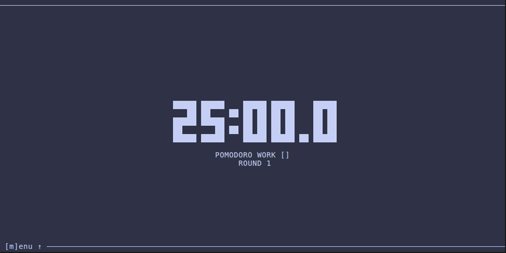
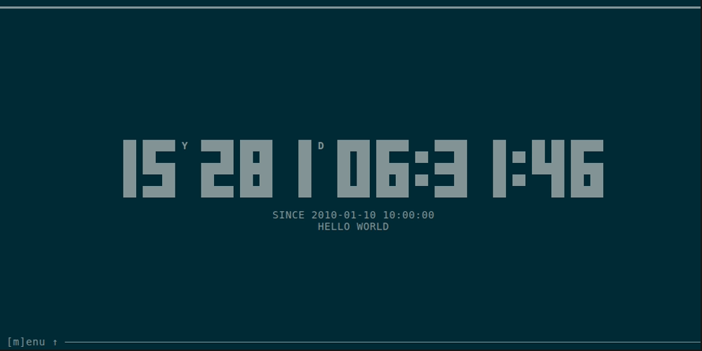
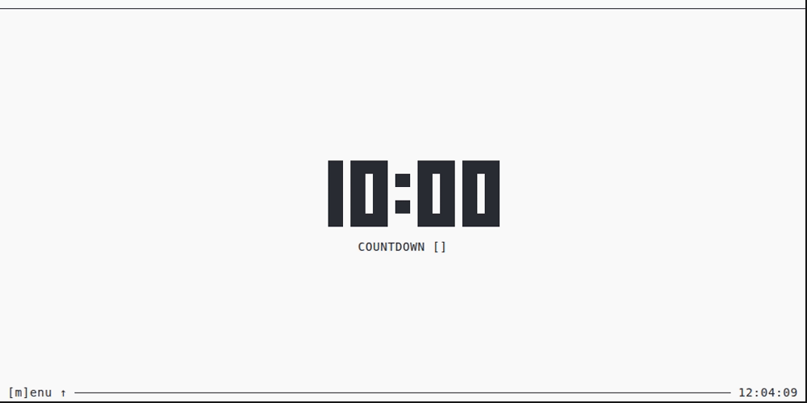
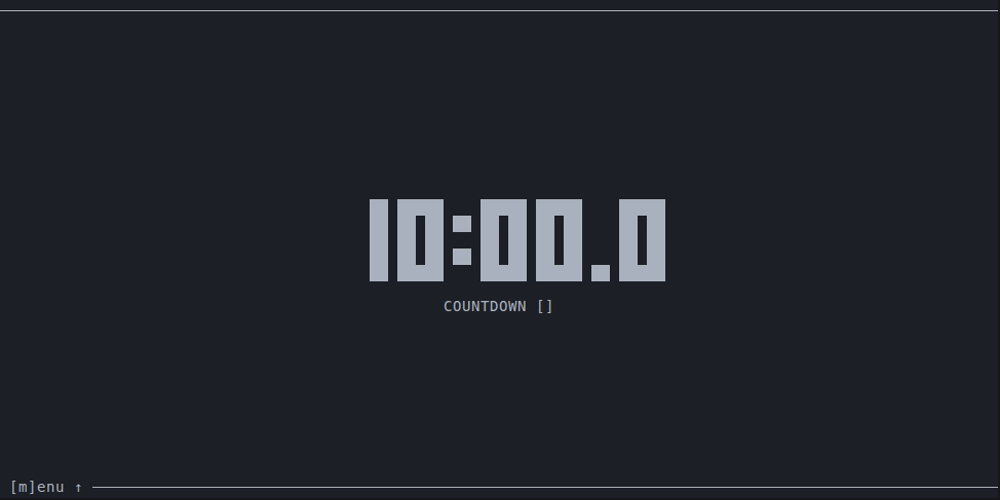
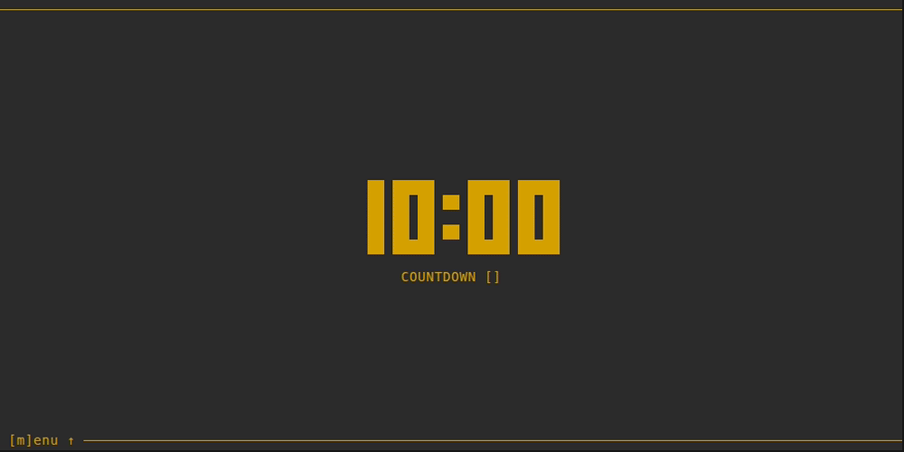

# timr-tui

[](https://crates.io/crates/timr-tui) [](https://github.com/sectore/timr-tui/actions/workflows/ci.yml) [](./LICENSE) [](https://ratatui.rs/)

TUI to organize your time: Pomodoro, Countdown, Timer, Event.

- `[1] countdown` Use it for your workout, yoga/breathing sessions, meditation, handstand or whatever.
- `[2] timer` Check the time on anything you are doing.
- `[3] pomodoro` Organize your working time to be focused all the time by following the [Pomodoro Technique](https://en.wikipedia.org/wiki/Pomodoro_Technique).
- `[4] event` Count the time for any event in the future or past.

# Table of Contents

- [Preview](./#preview)
- [CLI](./#cli)
- [Keybindings](./#keybindings)
- [Installation](./#installation)
- [Development](./#development)
- [Misc](./#misc)
- [Contributing](./#contributing)
- [License](./#license)

# Preview

_(theme depends on your terminal preferences)_

## Pomodoro

<a href="demo/pomodoro.gif">
  
</a>

## Timer

<a href="demo/timer.gif">
  
</a>

## Countdown (_incl. [Mission Elapsed Time](https://en.wikipedia.org/wiki/Mission_Elapsed_Time)_)

<a href="demo/countdown.gif">
  
</a>

## Event (_past/future_)

<a href="demo/event.gif">
  
</a>

## Local time

<a href="demo/local-time.gif">
  
</a>

## Local time (_footer_)

<a href="demo/local-time-footer.gif">
  
</a>

## Toggle deciseconds

<a href="demo/decis.gif">
  
</a>

## Maximum (_`9999y`_ _`364d`_ _`23:59:59.9`_)

<a href="demo/timer-max.png">
  
</a>

## Change style

<a href="demo/style.gif">
  
</a>

## Menu

<a href="demo/menu.gif">
  
</a>

# CLI

```sh
timr-tui --help

Usage: timr-tui [OPTIONS]

Options:
  -c, --countdown <COUNTDOWN>        Countdown time to start from. Formats: 'Yy Dd hh:mm:ss', 'Dd hh:mm:ss', 'Yy mm:ss', 'Dd mm:ss', 'Yy ss', 'Dd ss', 'hh:mm:ss', 'mm:ss', 'ss'. Examples: '1y 5d 10:30:00', '2d 4:00', '1d 10', '5:03'.
  -w, --work <WORK>                  Work time to count down from. Formats: 'ss', 'mm:ss', 'hh:mm:ss'
  -p, --pause <PAUSE>                Pause time to count down from. Formats: 'ss', 'mm:ss', 'hh:mm:ss'
  -e, --event <EVENT>                Event date time and title (optional). Format: 'YYYY-MM-DD HH:MM:SS' or 'time=YYYY-MM-DD HH:MM:SS[,title=...]'. Examples: '2025-10-10 14:30:00' or 'time=2025-10-10 14:30:00,title=My Event'.
  -d, --decis                        Show deciseconds.
  -m, --mode <MODE>                  Mode to start with. [possible values: countdown, timer, pomodoro, event, localtime]
  -s, --style <STYLE>                Style to display time with. [possible values: full, light, medium, dark, thick, cross, braille]
      --menu                         Open menu.
  -r, --reset                        Reset stored values to defaults.
  -n, --notification <NOTIFICATION>  Toggle desktop notifications. Experimental. [possible values: on, off]
      --blink <BLINK>                Toggle blink mode to animate a clock when it reaches its finished mode. [possible values: on, off]
      --log [<LOG>]                  Directory for log file. If not set, standard application log directory is used (check README for details).
  -h, --help                         Print help
  -V, --version                      Print version
```

Extra option (if `--features sound` is enabled by local build only):

```sh
--sound <SOUND>                Path to sound file (.mp3 or .wav) to play as notification. Experimental.
```

# Keybindings

## Menu

| Key                                         | Description |
| ------------------------------------------- | ----------- |
| <kbd>↑</kbd> / <kbd>↓</kbd> or <kbd>m</kbd> | Toggle menu |

## Screens

| Key          | Description     |
| ------------ | --------------- |
| <kbd>1</kbd> | Pomodoro        |
| <kbd>2</kbd> | Countdown       |
| <kbd>3</kbd> | Timer           |
| <kbd>4</kbd> | Event           |
| <kbd>0</kbd> | Local Time      |
| <kbd>→</kbd> | next screen     |
| <kbd>←</kbd> | previous screen |

## Controls

| Key          | Description     |
| ------------ | --------------- |
| <kbd>s</kbd> | start           |
| <kbd>r</kbd> | reset           |
| <kbd>e</kbd> | enter edit mode |
| <kbd>q</kbd> | quit            |

**In `edit` mode only:**

| Key                          | Description         |
| ---------------------------- | ------------------- |
| <kbd>s</kbd>                 | save changes        |
| <kbd>Esc</kbd>               | skip changes        |
| <kbd>←</kbd> or <kbd>→</kbd> | change selection    |
| <kbd>↑</kbd>                 | edit to go up       |
| <kbd>ctrl+↑</kbd>            | edit to go up 10x   |
| <kbd>↓</kbd>                 | edit to go down     |
| <kbd>ctrl+↓</kbd>            | edit to go down 10x |

**In `Event` `edit` mode only:**

| Key              | Description  |
| ---------------- | ------------ |
| <kbd>Enter</kbd> | save changes |
| <kbd>Esc</kbd>   | skip changes |
| <kbd>Tab</kbd>   | switch input |

**In `Pomodoro` screen only:**

| Key                                    | Description        |
| -------------------------------------- | ------------------ |
| <kbd>ctrl+←</kbd> or <kbd>ctrl+→</kbd> | switch work/pause  |
| <kbd>ctrl+r</kbd>                      | reset round        |
| <kbd>ctrl+s</kbd>                      | save initial value |

**In `Countdown` screen only:**

| Key               | Description        |
| ----------------- | ------------------ |
| <kbd>ctrl+e</kbd> | edit by local time |
| <kbd>ctrl+s</kbd> | save initial value |

## Appearance

| Key          | Description        |
| ------------ | ------------------ |
| <kbd>,</kbd> | toggle styles      |
| <kbd>.</kbd> | toggle deciseconds |
| <kbd>:</kbd> | toggle local time  |

# Installation

## Cargo

### From [crates.io](https://crates.io/crates/timr-tui)

```sh
cargo install timr-tui
```

### From GitHub repository

```sh
cargo install --git https://github.com/sectore/timr-tui
```

## Arch Linux

Install [from the AUR](https://aur.archlinux.org/packages/timr/):

```sh
paru -S timr
```

## Nix

_Note:_ Currently `timr-tui` is [available on the `unstable` channel](https://search.nixos.org/packages?channel=unstable&query=timr-tui) only.

### Command line

```sh
# default (w/o sound)
nix-env -iA nixpkgs.timr-tui
# or w/ sound enabled
nix-env -iA nixpkgs.timr-tui --arg timr-tui '(timr-tui.override { enableSound = true; })'
```

### Configuration

```nix
# default (w/o sound)
environment.systemPackages = with pkgs; [
  timr-tui
];
# or w/ sound enabled
environment.systemPackages = with pkgs; [
  (timr-tui.override { enableSound = true; })
];
```

### Home Manager

```nix
# default (w/o sound)
home.packages = with pkgs; [
  timr-tui
];
# or w/ sound enabled
home.packages = with pkgs; [
  (timr-tui.override { enableSound = true; })
];
```

Source at `nixpkgs`: <https://github.com/NixOS/nixpkgs/blob/nixos-unstable/pkgs/by-name/ti/timr-tui/package.nix>

## Release binaries

Pre-built artifacts are available to download from [latest GitHub release](https://github.com/sectore/timr-tui/releases).

# Development

## Requirements

### Nix users (recommend)

`cd` into root directory.

If you have [`direnv`](https://direnv.net) installed, run `direnv allow` once to install dependencies. In other case run `nix develop`.

### Non Nix users

- [`Rust`](https://www.rust-lang.org/learn/get-started)
- [`Clippy`](https://github.com/rust-lang/rust-clippy)
- [`rustfmt`](https://github.com/rust-lang/rustfmt)
- [`dprint`](https://dprint.dev)
- [`just`](https://just.systems)

### Commands

```sh
just

Available recipes:
    default                  # list commands

    [build]
    build                    # build app [alias: b]

    [demo]
    demo-blink               # build demo: blink animation [alias: db]
    demo-countdown           # build demo: countdown [alias: dc]
    demo-countdown-met       # build demo: countdown + met [alias: dcm]
    demo-decis               # build demo: deciseconds [alias: dd]
    demo-event               # build demo: event [alias: de]
    demo-local-time          # build demo: local time [alias: dlt]
    demo-local-time-footer   # build demo: local time (footer) [alias: dltf]
    demo-menu                # build demo: menu [alias: dm]
    demo-pomodoro            # build demo: pomodoro [alias: dp]
    demo-rocket-countdown    # build demo: rocket countdown [alias: drc]
    demo-style               # build demo: styles [alias: ds]
    demo-timer               # build demo: timer [alias: dt]

    [dev]
    run                      # run app [alias: r]
    run-args args            # run app with arguments. It expects arguments as a string (e.g. "-c 5:00"). [alias: ra]
    run-sound path           # run app while sound feature is enabled. It expects a path to a sound file. [alias: rs]
    run-sound-args path args # run app while sound feature is enabled by adding a path to a sound file and other arguments as string (e.g. "-c 5:00"). [alias: rsa]

    [misc]
    format                   # format files [alias: f]
    lint                     # lint [alias: l]

    [test]
    test                     # run tests [alias: t]
```

### Build

- Linux

```sh
nix build
# or for bulding w/ statically linked binaries
nix build .#linuxStatic
```

- Windows (cross-compilation)

```sh
nix build .#windows
```

### Run tests

```sh
cargo test
```

# Misc

## Persistant app state

Stored on file system:

```sh
# Linux
~/.local/state/timr-tui/data/app.data
# macOS
/Users/{user}/Library/Application Support/timr-tui/data/app.data
# Windows
C:/Users/{user}/AppData/Local/timr-tui/data/app.data
```

## Logs

To get log output, start the app by passing `--log` to `timr-tui`. See [CLI](./#cli) for details.

Logs will be stored in an `app.log` file at following locations:

```sh
# Linux
~/.local/state/timr-tui/logs/app.log
# macOS
/Users/{user}/Library/Application Support/timr-tui/logs/app.log
# `Windows`
C:/Users/{user}/AppData/Local/timr-tui/logs/app.log
```

Optional: You can use a custom directory by passing it via `--log` arg.

# Contributing

[CONTRIBUTING.md](./CONTRIBUTING.md)

# License

[MIT License](./LICENSE)
