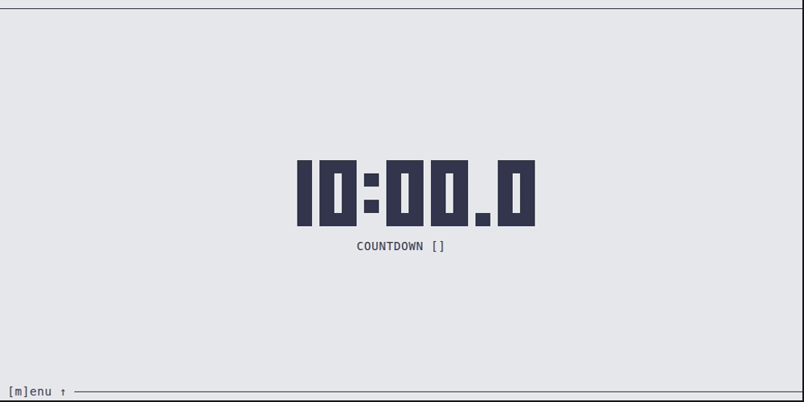
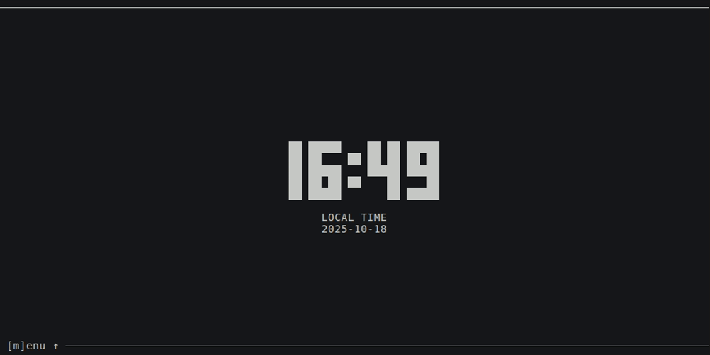

# timr-tui

TUI to organize your time: Pomodoro, Countdown, Timer.

- `[t]imer` Check the time on anything you are you doing.
- `[c]ountdown` Use it for your workout, yoga session, meditation, handstand or whatever.
- `[p]omodoro` Organize your working time to be focused all the time by following the [Pomodoro Technique](https://en.wikipedia.org/wiki/Pomodoro_Technique).

Built with [Ratatui](https://ratatui.rs/) / [Rust 🦀](https://www.rust-lang.org/).


# Table of Contents

- [Preview](./#preview)
- [CLI](./#cli)
- [Keybindings](./#keybindings)
- [Installation](./#installation)
- [Development](./#development)
- [Misc](./#misc)
- [License](./#license)

# Preview

_(theme depends on your terminal preferences)_

## Pomodoro

<a href="demo/pomodoro.gif">
  
</a>

## Timer

<a href="demo/timer.gif">
  
</a>

## Countdown

<a href="demo/countdown.gif">
  
</a>

## Change style

<a href="demo/style.gif">
  
</a>

## Toggle deciseconds

<a href="demo/decis.gif">
  
</a>

## Menu

<a href="demo/menu.gif">
  
</a>

## Local time (footer)

<a href="demo/local-time.gif">
  
</a>

## Mission Elapsed Time ([MET](https://en.wikipedia.org/wiki/Mission_Elapsed_Time))

<a href="demo/countdown-met.gif">
  
</a>

# CLI

```sh
timr-tui --help

Usage: timr-tui [OPTIONS]

Options:
  -c, --countdown <COUNTDOWN>        Countdown time to start from. Formats: 'ss', 'mm:ss', or 'hh:mm:ss'
  -w, --work <WORK>                  Work time to count down from. Formats: 'ss', 'mm:ss', or 'hh:mm:ss'
  -p, --pause <PAUSE>                Pause time to count down from. Formats: 'ss', 'mm:ss', or 'hh:mm:ss'
  -d, --decis                        Show deciseconds.
  -m, --mode <MODE>                  Mode to start with. [possible values: countdown, timer, pomodoro]
  -s, --style <STYLE>                Style to display time with. [possible values: full, light, medium, dark, thick, cross, braille]
      --menu                         Open the menu.
  -r, --reset                        Reset stored values to default values.
  -n, --notification <NOTIFICATION>  Toggle desktop notifications. Experimental. [possible values: on, off]
      --blink <BLINK>                Toggle blink mode to animate a clock when it reaches its finished mode. [possible values: on, off]
      --log [<LOG>]                  Directory to store log file. If not set, standard application log directory is used (check README for details).
  -h, --help                         Print help
  -V, --version                      Print version
```

Extra option (if `--features sound` is enabled by local build only):

```sh
--sound <SOUND>                Path to sound file (.mp3 or .wav) to play as notification. Experimental.
```

# Keybindings

## Menu

| Key | Description |
| --- | --- |
| <kbd>↑</kbd> / <kbd>↓</kbd> or <kbd>m</kbd> | Toggle menu |

## Screens

| Key | Description |
| --- | --- |
| <kbd>p</kbd> | Pomodoro |
| <kbd>c</kbd> | Countdown |
| <kbd>t</kbd> | Timer |

## Controls

| Key | Description |
| --- | --- |
| <kbd>s</kbd> | start |
| <kbd>r</kbd> | reset |
| <kbd>e</kbd> | enter edit mode |
| <kbd>q</kbd> | quit |

**In `edit` mode only:**

| Key | Description |
| --- | --- |
| <kbd>Enter</kbd> | apply changes |
| <kbd>Esc</kbd> | skip changes |
| <kbd>←</kbd> or <kbd>→</kbd> | change selection |
| <kbd>↑</kbd> or <kbd>↓</kbd> | change values to go up or down |

**In `Pomodoro` screen only**

| Key | Description |
| --- | --- |
| <kbd>←</kbd> or <kbd>→</kbd> | switch work/pause |
| <kbd>^r</kbd> | reset round |

**In `Countdown` screen only:**

| Key | Description |
| --- | --- |
| <kbd>^e</kbd> | edit by local time |

## Appearance

| Key | Description |
| --- | --- |
| <kbd>,</kbd> | toggle styles |
| <kbd>.</kbd> | toggle deciseconds |
| <kbd>:</kbd> | toggle local time in footer |

# Installation

## Cargo

### From [crates.io](https://crates.io/crates/timr-tui)

```sh
cargo install timr-tui
```

### From GitHub repository

```sh
cargo install --git https://github.com/sectore/timr-tui
```

## Arch Linux

Install [from the AUR](https://aur.archlinux.org/packages/timr/):

```sh
paru -S timr
```

## Release binaries

Pre-built artifacts are available to download from [latest GitHub release](https://github.com/sectore/timr-tui/releases).

# Development

## Requirements

### Nix users (recommend)

`cd` into root directory.

If you have [`direnv`](https://direnv.net) installed, run `direnv allow` once to install dependencies. In other case run `nix develop`.

### Non Nix users

- [`Rust`](https://www.rust-lang.org/learn/get-started)
- [`Clippy`](https://github.com/rust-lang/rust-clippy)
- [`rustfmt`](https://github.com/rust-lang/rustfmt)
- [`just`](https://just.systems)

### Commands

```sh
just

Available recipes:
    default               # list commands

    [build]
    build                 # build app [alias: b]

    [demo]
    demo-blink            # build demo: blink animation [alias: db]
    demo-countdown        # build demo: countdown [alias: dc]
    demo-countdown-met    # build demo: countdown + met [alias: dcm]
    demo-decis            # build demo: deciseconds [alias: dd]
    demo-local-time       # build demo: local time [alias: dlt]
    demo-menu             # build demo: menu [alias: dm]
    demo-pomodoro         # build demo: pomodoro [alias: dp]
    demo-rocket-countdown # build demo: rocket countdown [alias: drc]
    demo-style            # build demo: styles [alias: ds]
    demo-timer            # build demo: timer [alias: dt]

    [dev]
    run                      # run app [alias: r]
    run-args args            # run app with arguments. It expects arguments as a string (e.g. "-c 5:00"). [alias: ra]
    run-sound path           # run app while sound feature is enabled. It expects a path to a sound file. [alias: rs]
    run-sound-args path args # run app while sound feature is enabled by adding a path to a sound file and other arguments as string (e.g. "-c 5:00"). [alias: rsa]

    [misc]
    format                # format files [alias: f]
    lint                  # lint [alias: l]

    [test]
    test                  # run tests [alias: t]
```

### Build

- Linux

```sh
nix build
# or for bulding w/ statically linked binaries
nix build .#linuxStatic
```

- Windows (cross-compilation)

```sh
nix build .#windows
```

### Run tests

```sh
cargo test
```

# Misc.

## Persistant app state

Stored on file system:

```sh
# Linux
~/.local/state/timr-tui/data/app.data
# macOS
/Users/{user}/Library/Application Support/timr-tui/data/app.data
# Windows
C:/Users/{user}/AppData/Local/timr-tui/data/app.data
```

## Logs

To get log output, start the app by passing `--log` to `timr-tui`. See [CLI](./#cli) for details.

Logs will be stored in an `app.log` file at following locations:

```sh
# Linux
~/.local/state/timr-tui/logs/app.log
# macOS
/Users/{user}/Library/Application Support/timr-tui/logs/app.log
# `Windows`
C:/Users/{user}/AppData/Local/timr-tui/logs/app.log
```

Optional: You can use a custom directory by passing it via `--log` arg.

# License

[MIT License](./LICENSE)
