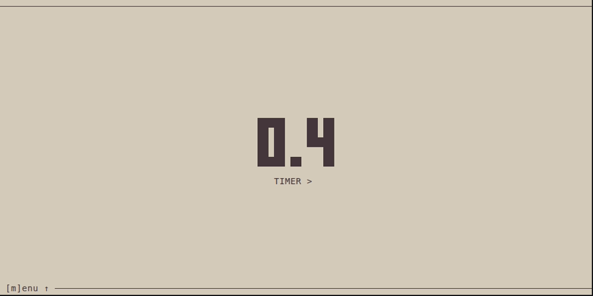

# timr-tui

TUI to organize your time: Pomodoro, Countdown, Timer.

- `[t]imer` Check the time on anything you are you doing.
- `[c]ountdown` Use it for your workout, yoga session, meditation, handstand or whatever.
- `[p]omodoro` Organize your working time to be focused all the time by following the [Pomodoro Technique](https://en.wikipedia.org/wiki/Pomodoro_Technique).

It's built with [`Ratatui`](https://ratatui.rs/) written in [Rust 🦀](https://www.rust-lang.org/).

# Features

_Side note:_ Theme colors depend on your terminal preferences.

## Pomodoro

<a href="demo/pomodoro.gif">
  
</a>

## Timer

<a href="demo/timer.gif">
  
</a>

## Countdown

<a href="demo/countdown.gif">
  
</a>

# More features

<details>
    <summary>Click to see more features</summary>

## Change style

<a href="demo/style.gif">
  
</a>

## Toggle deciseconds

<a href="demo/decis.gif">
  
</a>

## Menu

<a href="demo/menu.gif">
  
</a>

## Local time

<a href="demo/local-time.gif">
  
</a>

## Rocket countdown

<a href="demo/rocket-countdown.gif">
  
</a>

</details>

# CLI

```sh
timr-tui --help

Usage: timr-tui [OPTIONS]

Options:
  -c, --countdown <COUNTDOWN>  Countdown time to start from. Formats: 'ss', 'mm:ss', or 'hh:mm:ss' [default: 10:00]
  -w, --work <WORK>            Work time to count down from. Formats: 'ss', 'mm:ss', or 'hh:mm:ss' [default: 25:00]
  -p, --pause <PAUSE>          Pause time to count down from. Formats: 'ss', 'mm:ss', or 'hh:mm:ss' [default: 5:00]
  -d, --decis                  Wether to show deciseconds or not. [default: false]
  -m, --mode <MODE>            Mode to start with. [possible values: countdown, timer, pomodoro] [default: timer]
      --menu                   Whether to open the menu or not.
  -s, --style <STYLE>          Style to display time with. [possible values: full, light, medium, dark, thick, cross, braille] [default: full]
  -r, --reset                  Reset stored values to default.
  -h, --help                   Print help
  -V, --version                Print version
```

# Installation

## Cargo

### From [crates.io](https://crates.io/crates/timr-tui)

```sh
cargo install timr-tui
```

### From GitHub repository

```sh
cargo install --git https://github.com/sectore/timr-tui
```

## Arch Linux

Install [from the AUR](https://aur.archlinux.org/packages/timr/):

```sh
paru -S timr
```


## Release binaries

Pre-built artifacts are available to download from [latest GitHub release](https://github.com/sectore/timr-tui/releases).


# Development

## Requirements

### Nix users (recommend)

`cd` into root directory.

If you have [`direnv`](https://direnv.net) installed, run `direnv allow` once to install dependencies. In other case run `nix develop`.


### Non Nix users

- [`Rust`](https://www.rust-lang.org/learn/get-started)
- [`Clippy`](https://github.com/rust-lang/rust-clippy)
- [`rustfmt`](https://github.com/rust-lang/rustfmt)
- [`just`](https://just.systems)

### Commands

```sh
just --list

Available recipes:
    build   # build app
    b       # alias for `build`
    default
    format  # format files
    f       # alias for `format`
    lint    # lint
    l       # alias for `lint`
    run     # run app
    r       # alias for `run`
    test    # run tests
    t       # alias for `test`
```

### Build

- Linux
```sh
nix build
```

- Windows (cross-compilation)
```sh
nix build .#windows
```

# Misc.

## Persistant app state

Stored on file system:

```sh
# Linux
~/.local/state/timr-tui/data/app.data
# macOS
/Users/{user}/Library/Application Support/timr-tui/data/app.data
# Windows
C:/Users/{user}/AppData/Local/timr-tui/data/app.data
```

## Logs

In `debug` mode only. Locations:

```sh
# Linux
~/.local/state/timr/logs/app.log
# macOS
/Users/{user}/Library/Application Support/timr-tui/logs/app.log
# `Windows`
C:/Users/{user}/AppData/Local/timr-tui/logs/app.log
```
